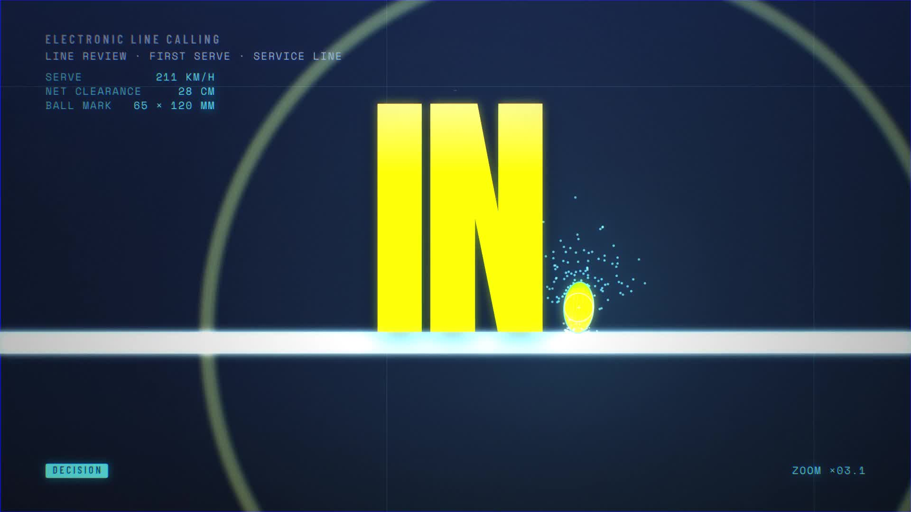

# NIGHT SESSION — a 10-second tennis motion-graphics film

A fully procedural, frame-accurate 10 s / 60 fps / 1080p tennis title sequence. No footage, no stock, no
3D package: every frame is drawn by HTML5 Canvas 2D code, captured by headless Chromium, encoded by ffmpeg,
and scored with a synthesized sound design. The result is [`out/tennis.mp4`](out/tennis.mp4) (1080p60, H.264 + AAC, 10.0 s), with [`out/tennis-preview.gif`](out/tennis-preview.gif) and a poster frame.



**Story (one serve on match point, broadcast-style):** floodlights ignite over an empty night-session court →
the ball hangs at the top of the toss → the racket detonates it (the strike *is* the cut) → we ride the
ball-tracking trajectory down the court → the bounce freezes on the service line while a pulse of light runs
through the court lines → the camera swoops into a line-calling render that dives 12.5× onto a 3 mm margin →
**IN** stamps with the ball-mark as its full stop → the ball flies into the lens and shrinks back to become the
period after **GAME. SET. MATCH** → the floodlights shut down bank by bank to black.

The complete frame-accurate build spec (shots, transitions, typography, sound cues) is in
[`docs/STORYBOARD.md`](docs/STORYBOARD.md); the shared drawing library is documented in
[`docs/API.md`](docs/API.md).

## Pipeline

```
src/index.html + src/lib/*.js + src/brand.js + src/scenes/*.js + src/timeline.js
        │  deterministic  render(t)  →  Canvas 2D (1920×1080)
        ▼
tools/render.cjs   headless Chromium (Playwright), N workers, optional multi-sample motion blur (--shutter 4)
        ▼
out/frames/frame_0000.png … frame_0599.png
        ▼                                  tools/audio.py + tools/cues.json  →  out/audio.wav (numpy synth)
tools/encode.sh    ffmpeg libx264 (crf 15, yuv420p, bt709) + AAC 320k  →  out/tennis.mp4, -preview.gif, -poster.jpg
```

Everything is a pure function of time: no `Math.random`, no wall clock, no mutable state between frames, so any
frame can be rendered in isolation, out of order, on any number of workers, and always comes out identical.

## Rebuild it

Requirements: Node ≥ 18 with Playwright + Chromium, Python 3 with numpy, ffmpeg.

```bash
cd tennis-animation
npm run render        # 600 frames, 4-sample motion blur, 3 workers  → out/frames
npm run audio         # procedural sound design                       → out/audio.wav
npm run encode        # H.264 + AAC, GIF preview, poster              → out/tennis.mp4
# or all three: npm run build
```

Useful during development:

```bash
node tools/render.cjs --frames 156,160,273,372            # specific absolute frames (full timeline)
node tools/render.cjs --scene scene3 --times 0,0.5,1.0     # one scene at scene-local seconds
node tools/render.cjs --start 0 --end 599 --step 10 --jpg  # quick preview pass
bash tools/strip.sh out/frames out/strip.png 6 320         # tile frames into one review image
bash tools/contact.sh                                      # per-second contact sheets for QA
npx http-server . -p 8080 -o /src/index.html               # interactive scrubber (space = play, ←/→ = step)
```

## Layout

| Path | What |
|---|---|
| `src/lib/core.js` | math, easings, deterministic hashing/noise, colour |
| `src/lib/fx.js` | glow, bloom, chromatic aberration, grain, vignette, flares, streaks, zoom/directional blur, shock rings |
| `src/lib/court.js` | ITF court geometry in metres, perspective camera, court/net/line renderers, ball physics, trajectory |
| `src/lib/ball.js` | 3D-shaded tennis ball (seam curve, felt, fibres, squash), motion-blurred ball, racket |
| `src/lib/particles.js` | stateless analytic particle bursts and ambient motes |
| `src/lib/text.js` | typography with tracking, kinetic per-character animators, wipes, rolling numbers, tags |
| `src/lib/transitions.js` | ball wipe, whip, slice, grid, zoom punch, glitch, mesh, iris, push, flash + the film's shockIris / scanWipe / irisTravel |
| `src/brand.js` | palette, font roles, scene-handoff state |
| `src/scenes/scene1..5.js` | Ignition · Toss & Strike · Flight/Freeze/Swoop · The Verdict · Game. Set. Match |
| `src/timeline.js` | scene sequencing, overlapping transitions, per-shot post stack |
| `tools/` | renderer, encoder, audio synth + cue list, contact-sheet and strip helpers |
| `fonts/` | Barlow Condensed, Barlow, Bebas Neue, Anton, Oswald, Space Mono (OFL) |

## Credits

Concept, storyboard, code, sound design: generated end-to-end with Claude Code. Fonts under the SIL Open Font License.
